<div align="center">


<p>
  <a href="https://github.com/YOUR_GITHUB_USERNAME/stepforge/actions/workflows/ci.yml"></a>
  
  
  
  
  
  
  
  
</p>

</div>

**StepForge** is a free, open-source QA studio that runs entirely on your computer. Record a UI test by clicking
through your app, add API, database, email and performance checks to the same scenario, run it with screenshots,
video and traces, and get a plain-English diagnosis of every failure. Then export the suite to Playwright, Cypress,
Selenium, k6 or Postman, or run it from the CLI and CI. No accounts, no cloud, no paid APIs.

<!--
  demo.gif — to record (about 30 s, 1440×900): Home → "Load demo workspace" → Run all tests → open a failed test and
  its diagnosis → Exports → Playwright preview. Ready-made WebM clips of the recorder, a live run and a diagnosis are in
  docs/assets/clips/ (scripts/capture_showcase.ts). Save as docs/assets/demo.gif and replace this comment with:
  <p align="center"></p>
-->

<p align="center">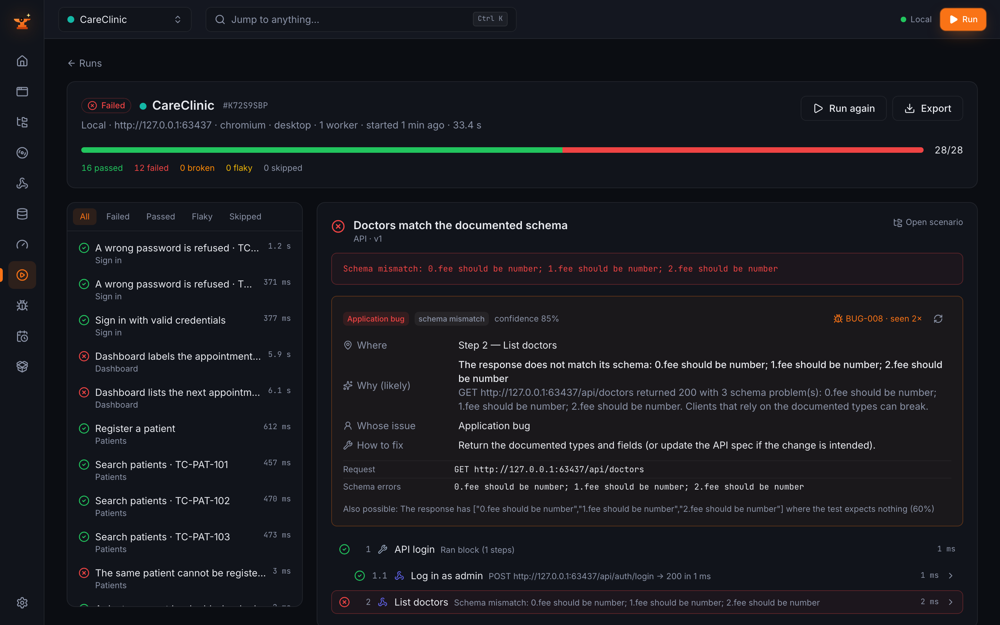</p>

## Contents

- [Why StepForge](#why-stepforge)
- [Features](#features)
- [Quick start](#quick-start)
- [Your first recorded test](#your-first-recorded-test)
- [How it works](#how-it-works)
- [Screenshots](#screenshots)
- [Export examples](#export-examples)
- [CLI and CI](#cli-and-ci)
- [Benchmarks](#benchmarks)
- [Data and privacy](#data-and-privacy)
- [Configuration](#configuration)
- [Safety and responsible use](#safety-and-responsible-use)
- [Troubleshooting](#troubleshooting)
- [Roadmap](#roadmap) · [Contributing](#contributing) · [License](#license)

## Why StepForge

|                                                        | Recorder-only tools | Paid testing platforms | **StepForge** |
| ------------------------------------------------------ | :-----------------: | :--------------------: | :-----------: |
| Record UI tests by clicking                            |         ✅          |           ✅           |      ✅       |
| API, database, email and performance steps in one test |          —          |       Sometimes        |      ✅       |
| Plain-English failure diagnosis                        |          —          |       Sometimes        |      ✅       |
| Runs fully offline, data stays on your machine         |      Sometimes      |           —            |      ✅       |
| Export to Playwright, Cypress, Selenium, k6, Postman   |    Usually one      |       Sometimes        |      ✅       |
| Free, no account or subscription                       |      Sometimes      |           —            |      ✅       |

## Features

| Layer | What you get |
| --- | --- |
| **UI** | ✅ Recorder with ranked, self-healing locators · assert/extract/mask from the toolbar · tabs, dialogs, iframes · screenshots, video, Playwright traces |
| **API** | ✅ REST and GraphQL steps · auth (bearer, basic, API key, OAuth2) · JSONPath and JSON Schema checks · import OpenAPI, Postman, cURL and HAR · contract checks |
| **Database** | ✅ SQLite, PostgreSQL, MySQL, SQL Server, MongoDB · read-only and rollback modes · SQL Workbench · data-quality audit |
| **Email** | ✅ Local Mailpit or IMAP · wait for an email · extract one-time codes and links |
| **Performance** | ✅ Web Vitals and Lighthouse · load tests with percentiles and threshold verdicts · k6 export · query plans |
| **Diagnosis** | ✅ Rule-based "where / why / whose issue / how to fix" · last-green diff · locator suggestions · automatic bug reports (PDF, Jira/Trello CSV, Markdown) |
| **Analytics** | ✅ Trends, quality gates, flaky detection, run comparison, top failing and slowest tests |
| **Scheduling** | ✅ Cron schedules · Telegram and email summaries · CLI with JUnit and HTML reports |
| **Export** | ✅ Playwright (TS, Python), Cypress, Selenium (Python, Java), pytest, REST Assured, k6, Postman, cURL, Markdown, Gherkin, Excel |

## Quick start

| You need | Version | Notes |
| --- | --- | --- |
| [Node.js](https://nodejs.org) | 20 or newer | Everything else (Playwright's Chromium, Mailpit) is installed by `setup` |
| [Git](https://git-scm.com) | any | |

**Windows**

```bat
git clone https://github.com/YOUR_GITHUB_USERNAME/stepforge.git
cd stepforge
setup.bat
start.bat
```

**macOS / Linux**

```bash
git clone https://github.com/YOUR_GITHUB_USERNAME/stepforge.git
cd stepforge
./setup.sh
./start.sh
```

StepForge opens at <http://127.0.0.1:4400> (or the next free port).

### Load the demo workspace in 60 seconds

1. On the welcome screen, choose **Load demo workspace**. StepForge starts two demo apps, **CareClinic** (a clinic) and
   **ShopDesk** (a shop back office), plus the local email catcher, and adds 45 scenarios across UI, API, database,
   email, business logic and performance.
2. Press **Run all tests**: one run per demo app. The red tests are real defects planted in the demo apps.
3. Open a failed test to see where it failed, why, whose issue it is and how to fix it.

Demo sign-ins, if you want to click around yourself: CareClinic `reception@careclinic.test` / `Reception123!` (admin:
`admin@careclinic.test` / `Admin123!`); ShopDesk `cashier@shopdesk.test` / `Cashier123!` (admin:
`admin@shopdesk.test` / `Admin123!`). Prefer the command line? `npm start -- --demo` loads the same workspace.

## Your first recorded test

1. **Create an application** (welcome screen → *Create an application*), then add an environment with your app's base URL.
   A short guided tour walks you through the next steps.
2. **Recorder** → pick the environment and the start page → **Start recording**. A Chromium window opens with the
   StepForge toolbar. You can also start from the **Test Explorer**: *Create & record* when you add a scenario,
   *Record steps* on a scenario (the steps are added to it), or *Record a scenario* in a module's menu.

   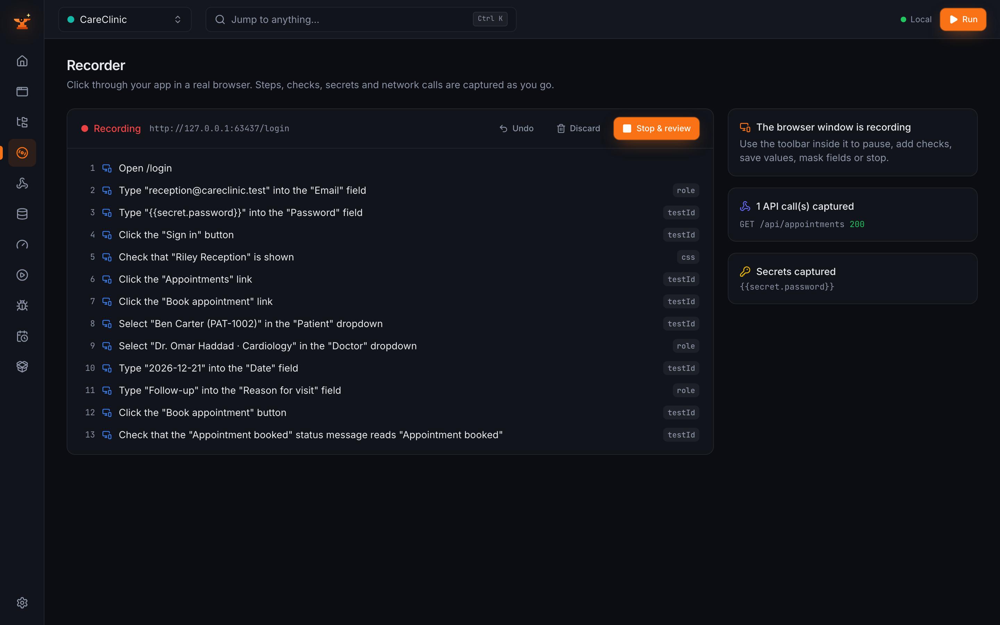
3. **Click through your app.** Every click and field becomes a step with ranked locators. Use the toolbar to add a
   check (*Assert*), keep a value (*Extract*) or hide a value (*Mask*); passwords become encrypted secrets automatically.
4. **Stop and save** the steps as a scenario. Edit them as a list, a flow or plain English in the Test Explorer.

   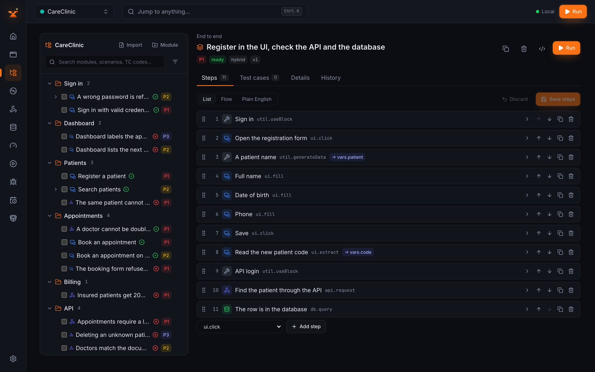
5. **Run it** (the *Run* button) and watch it live. A failure comes with screenshots, video, a trace and a diagnosis.

## How it works

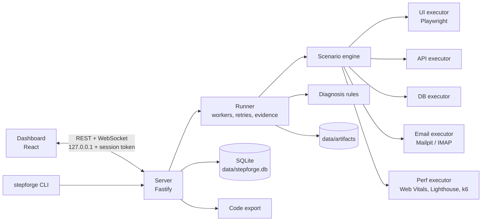

Every test is a list of **steps** of one shape: `type` (e.g. `ui.click`, `api.request`, `db.query`,
`email.waitForEmail`), `params`, ranked `locators`, `assertions`, and options such as retries, timeouts and
`captureAs`. Values can use `{{env.x}}`, `{{secret.x}}`, `{{data.x}}` and `{{vars.x}}`, so one scenario can sign in
through the UI, call the API with the token it captured and check the database row it created. See
[docs/ARCHITECTURE.md](docs/ARCHITECTURE.md) and the [step reference](docs/STEP_REFERENCE.md).

## Screenshots

<table>
  <tr>
    <td>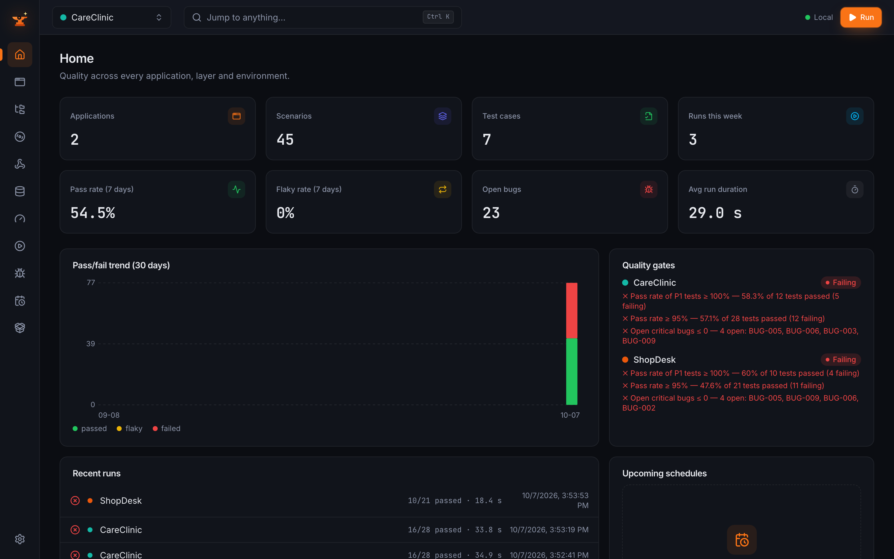<br/><sub><b>Home</b> — trends, quality gates, recent runs</sub></td>
    <td><br/><sub><b>Test Explorer</b> — modules, scenarios, steps</sub></td>
  </tr>
  <tr>
    <td><br/><sub><b>Run results</b> — evidence and diagnosis</sub></td>
    <td>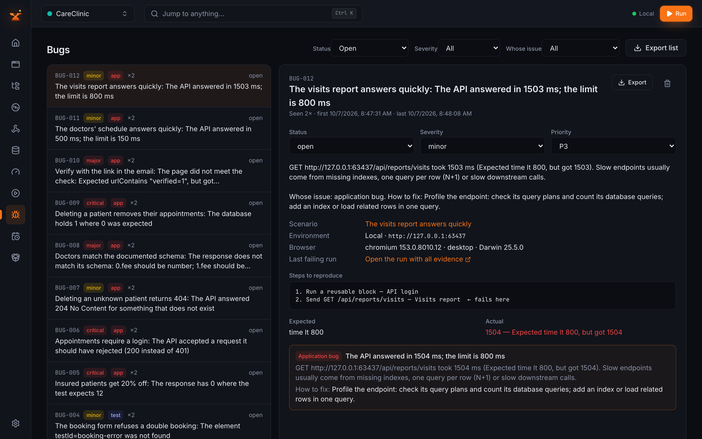<br/><sub><b>Bugs</b> — filed automatically, exportable</sub></td>
  </tr>
  <tr>
    <td>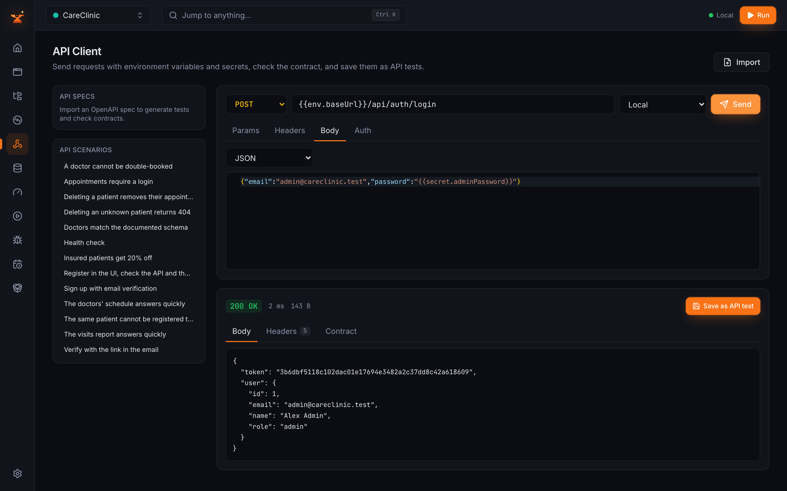<br/><sub><b>API Client</b> — requests, imports, contract checks</sub></td>
    <td>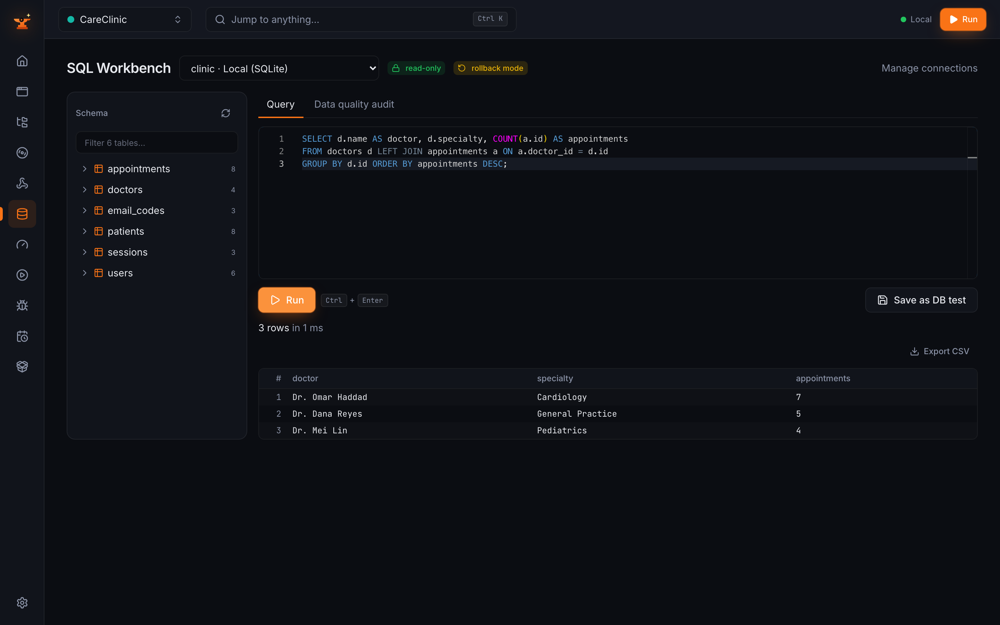<br/><sub><b>SQL Workbench</b> — queries and data-quality audit</sub></td>
  </tr>
  <tr>
    <td>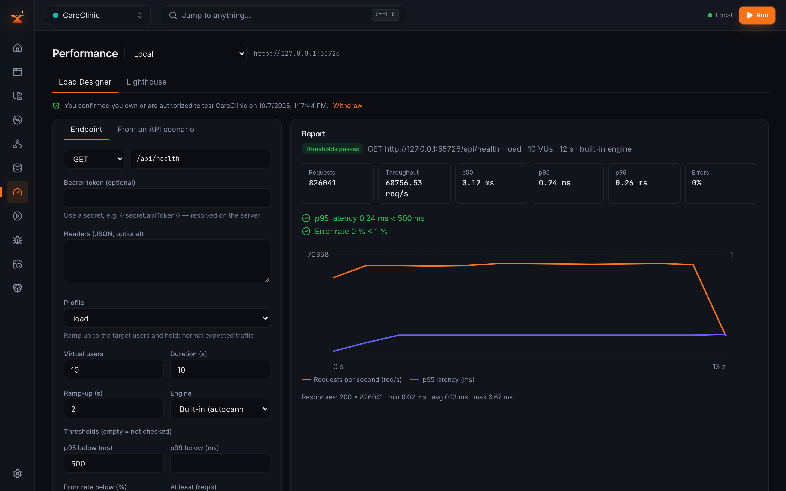<br/><sub><b>Performance</b> — load tests and Lighthouse</sub></td>
    <td>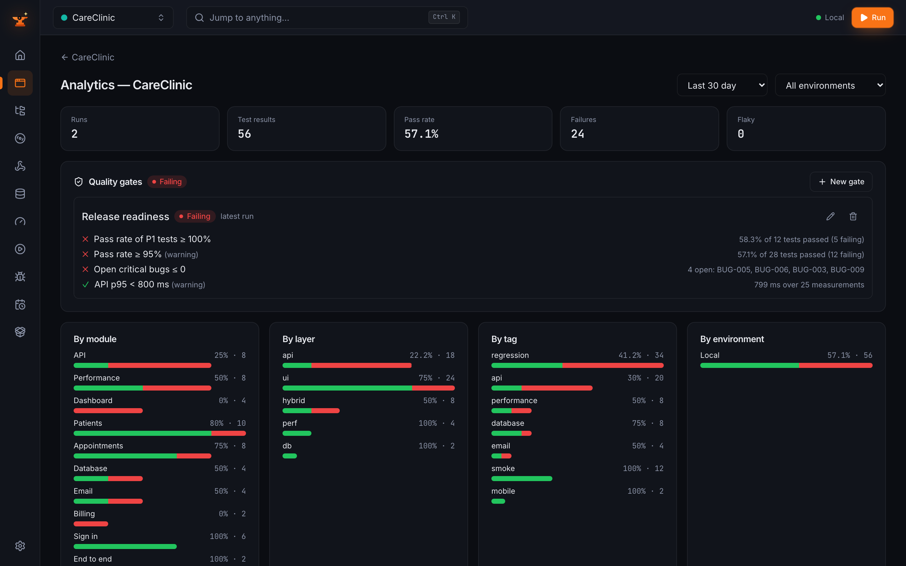<br/><sub><b>Analytics</b> — breakdowns, flaky and slowest tests</sub></td>
  </tr>
  <tr>
    <td>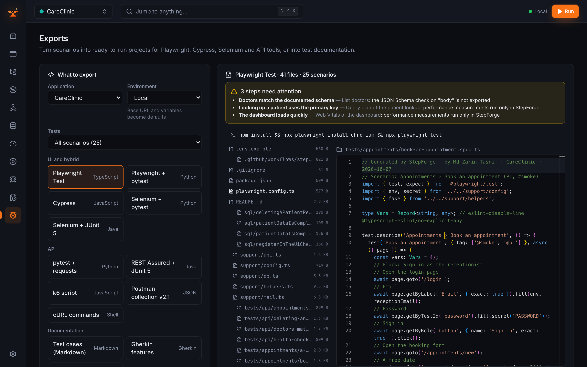<br/><sub><b>Exports</b> — 13 targets with preview</sub></td>
    <td>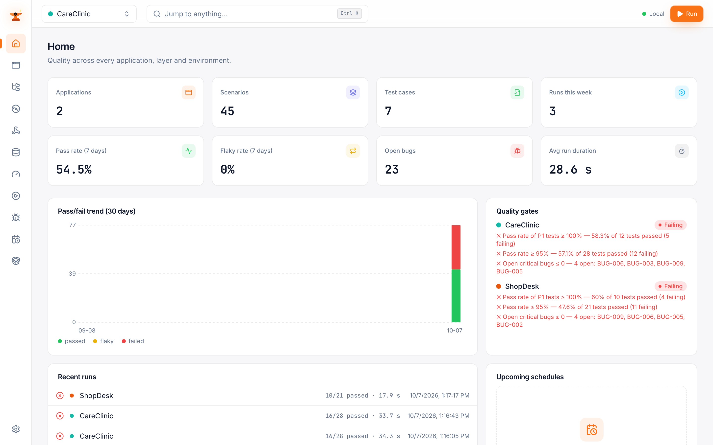<br/><sub><b>Light theme</b></sub></td>
  </tr>
</table>

## Export examples

The demo's "Register a patient" scenario, exported by StepForge (abridged):

<details>
<summary><b>Playwright Test (TypeScript)</b></summary>

```ts
test(`${code} ${title}`, { tag: ['@smoke', '@p1'] }, async ({ page }) => {
  const vars: Vars = {};
  // Block: Sign in
  await page.goto('/login');
  await page.getByLabel('Email', { exact: true }).fill(String(data.email));
  await page.getByTestId('password').fill(secret('PASSWORD'));
  await page.getByRole('button', { name: 'Sign in', exact: true }).click();
  await expect(page).toHaveURL(new RegExp('/$'));
  // Open the registration form
  await page.getByTestId('quick-new-patient').click();
  vars.patient = fake('name');
  await page.getByLabel('Full name', { exact: true }).fill(String(vars.patient));
  await page.getByLabel('Date of birth', { exact: true }).fill('1990-05-17');
  await page.getByTestId('patient-phone').fill('+1-555-777-1234');
  await page.getByTestId('save-patient').click();
  await expect(page.getByRole('status')).toHaveText(new RegExp('Patient PAT-\\d+ registered'));
});
```

</details>

<details>
<summary><b>Cypress (JavaScript)</b></summary>

```js
it(`${code} ${title}`, () => {
  const vars = {};
  // Block: Sign in
  cy.visit('/login');
  cy.findByLabelText('Email').fill(String(data.email));
  cy.findByTestId('password').fill(secret('PASSWORD'));
  cy.findByRole('button', { name: 'Sign in' }).click();
  cy.url().should('match', new RegExp('/$'));
  // Open the registration form
  cy.findByTestId('quick-new-patient').click();
  cy.then(() => {
    vars.patient = fake('name');
  });
  cy.then(() => {
    cy.findByLabelText('Full name').fill(String(vars.patient));
  });
  cy.findByLabelText('Date of birth').fill('1990-05-17');
  cy.findByTestId('patient-phone').fill('+1-555-777-1234');
  cy.findByTestId('save-patient').click();
  cy.findByRole('status').should(($el) => expect($el.text()).to.match(new RegExp('Patient PAT-\\d+ registered')));
});
```

</details>

<details>
<summary><b>Selenium + pytest (Python)</b></summary>

```python
def test_register_a_patient(browser, data):
    vars = {}
    # Block: Sign in
    browser.goto("/login")
    browser.fill(("label", "Email"), text(data.get("email")))
    browser.fill(("testId", "password"), secret("PASSWORD"))
    browser.click(("role", "button", "Sign in"))
    browser.expect("urlMatches", expected="/$")
    # Open the registration form
    browser.click(("testId", "quick-new-patient"))
    vars["patient"] = fake("name")
    browser.fill(("label", "Full name"), text(vars.get("patient")))
    browser.fill(("label", "Date of birth"), "1990-05-17")
    browser.fill(("testId", "patient-phone"), "+1-555-777-1234")
    browser.click(("testId", "save-patient"))
    browser.expect("textMatches", ("role", "status"), expected="Patient PAT-\\d+ registered")
```

</details>

Exported projects come with their own README, `.env.example` (secret values are never exported), helpers and
optional CI files. Every target was run green against the demo app; see [docs/CODEGEN.md](docs/CODEGEN.md).

## CLI and CI

```bash
./stepforge.sh run --app careclinic --env Local --tag smoke --junit results.xml --html report.html
./stepforge.sh codegen --app careclinic --target playwright-ts --out ../careclinic-tests
./stepforge.sh export --app careclinic --out careclinic.json     # tests as JSON, no secrets
```

Exit code 0 when everything passed, 1 when a test failed, 2 for usage errors. Windows uses `stepforge.bat`. Cron,
Windows Task Scheduler and GitHub Actions recipes: [docs/CLI.md](docs/CLI.md). Schedules with Telegram/email
summaries: [docs/SCHEDULING.md](docs/SCHEDULING.md).

## Benchmarks

The two demo apps contain bugs planted on purpose, listed with the acceptable diagnosis for each in
`demo/manifests/planted_bugs.json`. StepForge never reads that file (a guard test fails the build if app code mentions
it). `scripts/benchmark.ts` runs every demo scenario at desktop size and the phone scenarios at mobile size, then
scores the results against the manifest and writes [`docs/benchmarks.json`](docs/benchmarks.json).

| | Result |
| --- | --- |
| Planted bugs detected | **25 / 25 (100%)** |
| Diagnosed correctly | **24 / 25 (96%)** |
| False alarms | **0** |
| Scenarios / test runs | 45 / 51 |
| Total run time | 83.6 s |

| Demo app | Scenarios | Test runs | Planted bugs | Detected | Diagnosed correctly |
| --- | --- | --- | --- | --- | --- |
| CareClinic | 25 | 29 | 13 | 13 | 12 |
| ShopDesk | 20 | 22 | 12 | 12 | 12 |

Planted bugs cover API, database, UI, email, business logic and performance. Measured on an Apple M3 Pro (11 cores,
18 GB, Node 23.6), one test at a time. The one wrong diagnosis is described in
[docs/KNOWN_ISSUES.md](docs/KNOWN_ISSUES.md). Run it yourself: `npm run mailpit:install && npx tsx scripts/benchmark.ts`.

**Case study and samples.** A 15-slide case study ([HTML](docs/case-study/case-study.html),
[PDF](docs/case-study/export/StepForge-Case-Study.pdf), [write-up](docs/case-study/CASE_STUDY.md)) and real exported
files (bug report PDF, run reports, a Playwright project, Cypress, Selenium and k6) in [docs/samples](docs/samples).

## Data and privacy

- Everything runs on your computer. The server listens on `127.0.0.1` only and every request needs a per-start
  session token, so other websites cannot call it.
- Data lives in `./data`: the SQLite database (`stepforge.db`), evidence files (`artifacts/`), automatic backups taken
  before upgrades (`backups/`) and the encryption key (`.key`). Back up the folder to keep your work.
- Secrets (passwords, tokens) are encrypted with AES-256-GCM. They are masked as `••••` in the dashboard, reports and
  logs, never included in exports or generated code, and you can rotate the key in Settings.
- Nothing is sent anywhere. The optional AI explanations use a local [Ollama](https://ollama.com) only, and
  StepForge works fully without it.

## Configuration

<details>
<summary><b>Environment variables (.env)</b></summary>

Copy `.env.example` to `.env` to change defaults:

| Variable | Default | Meaning |
| --- | --- | --- |
| `STEPFORGE_PORT` | `4400` | Dashboard port (the next free port is used if busy) |
| `STEPFORGE_DATA_DIR` | `./data` | Where the database, evidence and key live |
| `STEPFORGE_OPEN_BROWSER` | `1` | Open the dashboard on start |
| `STEPFORGE_LOG_LEVEL` | `info` | Server log level |
| `STEPFORGE_MAILPIT_PORT` / `STEPFORGE_MAILPIT_SMTP_PORT` | `8025` / `1025` | Local Mailpit ports |
| `STEPFORGE_BIN_DIR` | `./data/bin` | Downloaded tools (Mailpit, k6) |
| `STEPFORGE_DEMO` | — | `1` loads the demo workspace on start (same as `npm start -- --demo`) |

</details>

<details>
<summary><b>Settings in the dashboard</b></summary>

Theme · runner defaults (browser, viewport, workers, timeout) · evidence retention · Mailpit · k6 · notification
channels · report author and branding · local AI (Ollama) · application import/export · demo workspace · encryption
key rotation · danger zone.

</details>

## Safety and responsible use

Test only systems you own or are authorised to test. Load tests ask you to confirm that once per application;
production environments get a red banner, and destructive database queries or load tests against them require typing
the application name. Database connections default to read-only with rollback. StepForge does not solve CAPTCHAs or
bypass two-factor authentication. See [LEGAL.md](LEGAL.md) and [SECURITY.md](SECURITY.md).

## Troubleshooting

<details>
<summary><b>Port 4400 is in use</b></summary>

StepForge tries the next ports automatically and prints the address it uses. To choose one, set `STEPFORGE_PORT` in `.env`.

</details>

<details>
<summary><b>"Executable doesn't exist" / the browser does not start</b></summary>

Install Playwright's Chromium again: `npx playwright install chromium` (Linux may also need `npx playwright install-deps chromium`).

</details>

<details>
<summary><b>Windows: "running scripts is disabled on this system"</b></summary>

Use `setup.bat` / `start.bat` from Command Prompt, or allow npm's scripts in PowerShell for your user:
`Set-ExecutionPolicy -Scope CurrentUser RemoteSigned`.

</details>

<details>
<summary><b>Antivirus blocks a download or the browser</b></summary>

Setup downloads Chromium (Playwright) and Mailpit from their official sources. Allow `node.exe` and the
`ms-playwright` folder, or install them manually and retry.

</details>

<details>
<summary><b>Mailpit does not start / port 1025 or 8025 is taken</b></summary>

Change `STEPFORGE_MAILPIT_PORT` and `STEPFORGE_MAILPIT_SMTP_PORT` in `.env`, then use Settings → Email → Start. Offline
installs can put the Mailpit binary in `data/bin` themselves.

</details>

<details>
<summary><b>IMAP login fails (Gmail, Outlook)</b></summary>

Use an app password (with two-step verification enabled) rather than your normal password, and make sure IMAP is
enabled for the mailbox. See [docs/EMAIL.md](docs/EMAIL.md).

</details>

More: [docs/KNOWN_ISSUES.md](docs/KNOWN_ISSUES.md).

## Roadmap

- [x] UI recorder, scenario editor, runner with evidence
- [x] API, database, email and performance testing
- [x] Diagnosis, bug reports, analytics and quality gates
- [x] Schedules, notifications, CLI, JUnit
- [x] Code export to 13 targets
- [x] Onboarding with a demo workspace
- [x] A second demo app (ShopDesk) and published benchmarks
- [x] Showcase material: case study, samples, screenshots and clips
- [ ] An optional desktop installer (Electron)
- [ ] Visual checkpoints (screenshot comparison)

## Contributing

Issues and pull requests are welcome. Start with [CONTRIBUTING.md](CONTRIBUTING.md); the build history is in
[docs/PROGRESS.md](docs/PROGRESS.md) and the design in [docs/ARCHITECTURE.md](docs/ARCHITECTURE.md).

## License

[MIT](LICENSE) © Md Zarin Tasnim

<div align="center">
  <br/>
  
  <h3>Md Zarin Tasnim</h3>
  <p>Creator of StepForge</p>
  <p>
    <a href="https://www.upwork.com/freelancers/~01b847509724f9e1ff"></a>
    <a href="https://github.com/YOUR_GITHUB_USERNAME"></a>
  </p>
</div>
