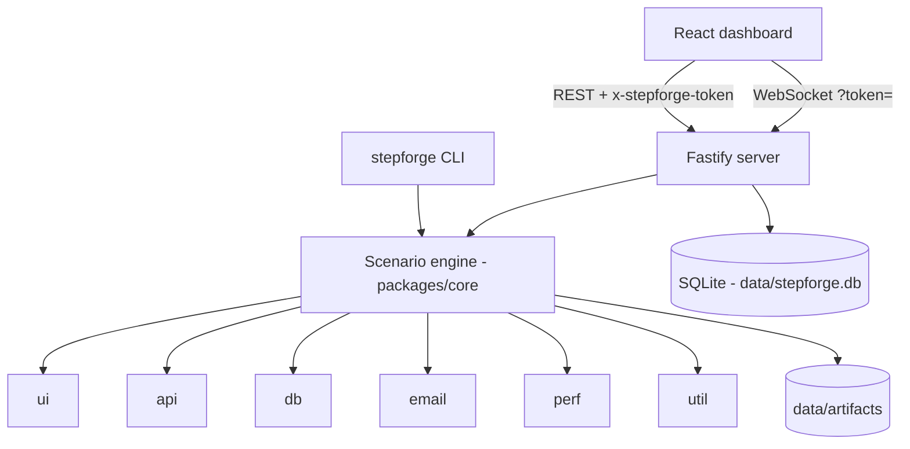

# Architecture

StepForge is a single Node.js process (Fastify) that serves a React dashboard and a JSON/WebSocket API on
`127.0.0.1`. All state lives in one SQLite file plus an artifacts folder under `data/`.

## Packages

| Package | Responsibility |
|---|---|
| `@stepforge/core` | Zod schemas, unified step model + catalogue, variable resolver, (Phase 3) scenario engine |
| `@stepforge/db` | Drizzle schema, migrations, open/backup/migrate, repositories |
| `@stepforge/crypto` | AES-256-GCM secrets, master key management |
| `@stepforge/server` | HTTP/WS API, security hooks, static UI hosting, job queue + scheduler host |
| `@stepforge/web` | Dashboard |

## Request security

1. **Bind:** the listen call hard-codes `127.0.0.1`.
2. **Host allow-list:** requests whose `Host` is not `localhost`, `127.0.0.1` or `[::1]` get 403 — this defeats DNS-rebinding.
3. **Session token:** generated per start, injected into `index.html`, required on every `/api/*` route except `/api/health`. Another website cannot read it (same-origin policy), so it cannot drive the API.
4. **No request logging** — headers and bodies may contain secrets.

## Step model

Every step, in every layer, has the same shape (see `packages/core/src/schemas/steps.ts`):
`type` (`<group>.<name>`), `label`, `params`, `locators[]`, `assertions[]`, `enabled`, `continueOnFail`,
`timeoutMs`, `retries`, `captureAs`. Executors register by group prefix, so new step types never change the engine.
