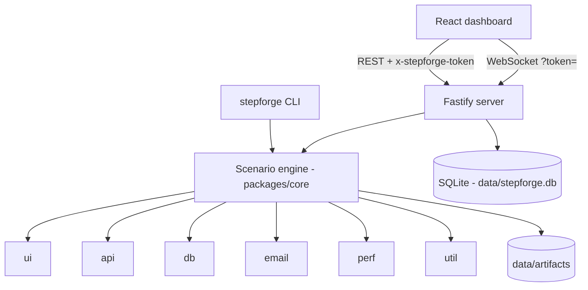

# Architecture

_By Md Zarin Tasnim · part of the StepForge documentation_

StepForge is a single Node.js process (Fastify) that serves a React dashboard and a JSON/WebSocket API on
`127.0.0.1`. All state lives in one SQLite file plus an artifacts folder under `data/`.

## Packages

| Package | Responsibility |
|---|---|
| `@stepforge/core` | Zod schemas, unified step model + catalogue, variable resolver, scenario engine, plain English, variants |
| `@stepforge/db` | Drizzle schema, migrations, open/backup/migrate, repositories |
| `@stepforge/crypto` | AES-256-GCM secrets, master key management |
| `@stepforge/executor-ui` | Playwright UI steps, ranked/self-healing locators, evidence |
| `@stepforge/executor-api` | HTTP/GraphQL steps, auth, cookies, JSONPath, JSON Schema, contract hook |
| `@stepforge/executor-db` | SQLite/PostgreSQL/MySQL/SQL Server/MongoDB drivers, SQL safety guard, rollback mode, data-quality audit |
| `@stepforge/email` | Mailpit and IMAP mailboxes, OTP/link extraction, Mailpit installer and process control |
| `@stepforge/executor-email` | Email steps (wait, assert, extract, open link) |
| `@stepforge/perf` | Load engine (autocannon), k6 export/bridge, Web Vitals, Lighthouse |
| `@stepforge/executor-perf` | Performance steps (page metrics, Lighthouse, load test, query plan) |
| `@stepforge/diagnosis` | Rule engine, YAML rules, last-green diff |
| `@stepforge/reports` | Bug and run report rendering: HTML, PDF (Chromium), XLSX, CSV, Markdown, JUnit XML |
| `@stepforge/analytics` | Daily aggregates, Home and application analytics, flaky detection, quality gates, run comparison |
| `@stepforge/notify` | Run summaries for Telegram (Bot API) and email (SMTP via nodemailer) |
| `@stepforge/executor-util` | Variables, generated data, sandboxed scripts |
| `@stepforge/recorder` | Recording browser, injected toolbar, network capture |
| `@stepforge/importers` | OpenAPI/Swagger, Postman, cURL and HAR → scenarios |
| `@stepforge/server` | HTTP/WS API, security hooks, static UI hosting, job queue, in-app scheduler (croner) and notifications |
| `@stepforge/cli` | `stepforge` command: builds the server in-process (embedded mode, no listener, no scheduler, no crash recovery) to run tests, write reports, export/import applications |
| `@stepforge/web` | Dashboard |

## Request security

1. **Bind:** the listen call hard-codes `127.0.0.1`.
2. **Host allow-list:** requests whose `Host` is not `localhost`, `127.0.0.1` or `[::1]` get 403 — this defeats DNS-rebinding.
3. **Session token:** generated per start, injected into `index.html`, required on every `/api/*` route except `/api/health`. Another website cannot read it (same-origin policy), so it cannot drive the API.
4. **No request logging** — headers and bodies may contain secrets.

## Step model

Every step, in every layer, has the same shape (see `packages/core/src/schemas/steps.ts`):
`type` (`<group>.<name>`), `label`, `params`, `locators[]`, `assertions[]`, `enabled`, `continueOnFail`,
`timeoutMs`, `retries`, `captureAs`. Executors register by group prefix, so new step types never change the engine.

## Database safety

Database steps and the SQL Workbench go through one policy (`checkPolicy` in `@stepforge/executor-db`) before
anything reaches a database: read-only connections refuse writes (statement classification across all SQL
dialects plus a read-only session where the engine supports it), rollback mode owns the transaction, and writes
on production connections need the application name. Connection passwords are decrypted only inside the
server process, just before connecting. Details: [DATABASES.md](DATABASES.md).
