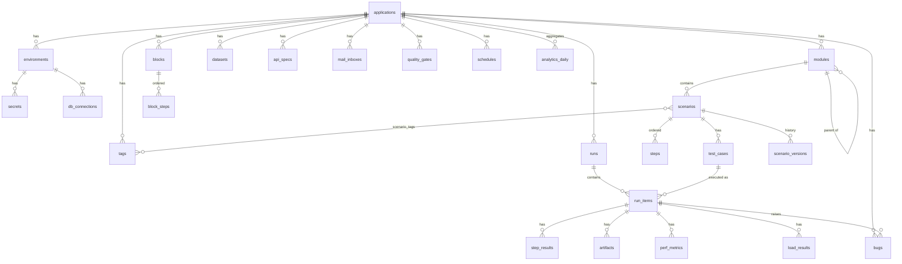

# Data Model

StepForge stores its own data in `data/stepforge.db` (SQLite, WAL mode). The schema is defined in
[`packages/db/src/schema.ts`](../packages/db/src/schema.ts); migrations live in `packages/db/migrations` and run
automatically on start (an existing database is backed up to `data/backups/` first).

Conventions: ULID primary keys, ISO-8601 `created_at` / `updated_at` on every table, `*_json` columns are TEXT
validated with Zod at the API boundary, booleans are 0/1 integers. Large payloads (bodies, DOM, videos, traces)
live in `data/artifacts/` and tables store only paths.

## Deletion behaviour

Deleting an application cascades to everything it owns. Deleting a test case keeps historic `run_items`
(`test_case_id` becomes NULL) so analytics stay accurate. Secrets referenced by connections/inboxes/channels are
detached (`SET NULL`), never silently reused.
