# StepForge — case study

_By Md Zarin Tasnim · part of the StepForge documentation_

> **Record once. Test every layer. Export anywhere.**
> A free, open-source QA studio that runs entirely on your own computer. Every number below comes from
> [`docs/benchmarks.json`](../benchmarks.json), measured by `scripts/benchmark.ts`.

The slide deck is [`case-study.html`](case-study.html) (open it in a browser), also available as
[`export/StepForge-Case-Study.pdf`](export/StepForge-Case-Study.pdf).

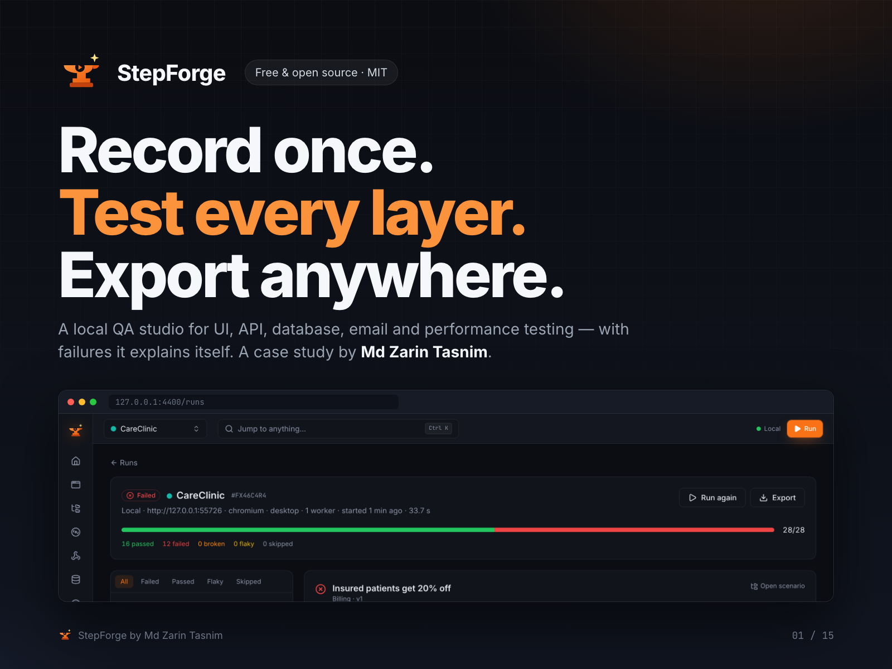

## 1. The problem

A real user journey, like signing up, booking an appointment or paying a bill, touches the UI, an API, a database and
often an inbox. The usual toolkit splits these up: a browser recorder, an API client, a SQL tool, a mail catcher and a
load tester, each with its own login, variables and reports. When a test goes red, the output is usually a stack trace
and someone has to work out whether the app, the test, the data or the environment is to blame.

The all-in-one alternatives tend to be paid per seat, want your credentials and screenshots in their cloud, and keep
your tests in their format.

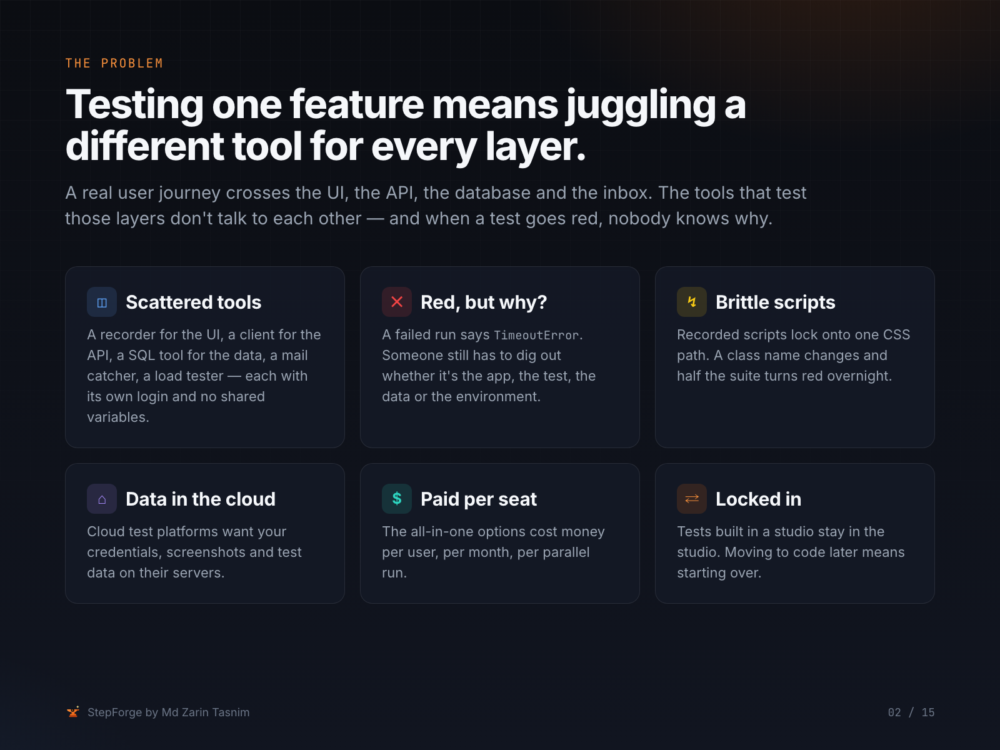

## 2. The goal

I set out to build one tool that:

- records a journey in a real browser and turns it into a readable, resilient test;
- lets a single scenario mix UI, API, SQL, email and performance steps, with shared variables and secrets;
- explains every failure: where it broke, why, whose problem it is and how to fix it, without needing AI;
- exports to the frameworks teams already use, so nothing is locked in;
- runs 100% locally (bound to 127.0.0.1), with no paid services and no data leaving the machine.

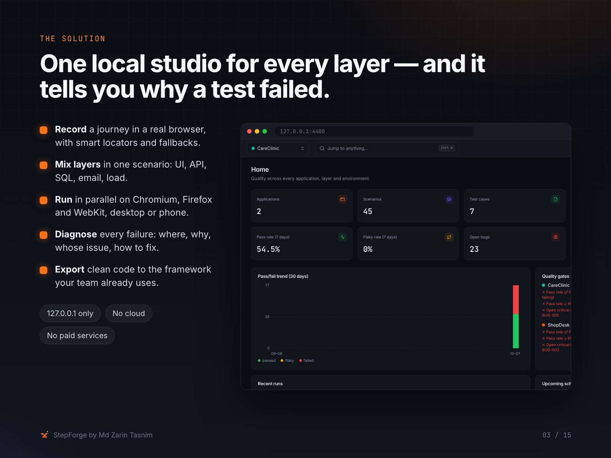

## 3. What I built

### Record once

The recorder opens the app in a real Chromium window and injects a small toolbar: pause, add a check, extract a value,
mask a field. Each recorded step stores a ranked set of locators (test id, role, label, text, CSS), so a renamed class
doesn't break the test, and a failed locator suggests a one-click fix. Typed passwords become `{{secret.…}}`
references automatically.

Recording starts wherever the user is: from the Recorder page, or from the Test Explorer, with *Create & record* in
the New scenario dialog, *Record steps* on a scenario (the steps are added after its existing ones, reviewed first) or
*Record a scenario* in a module's menu.

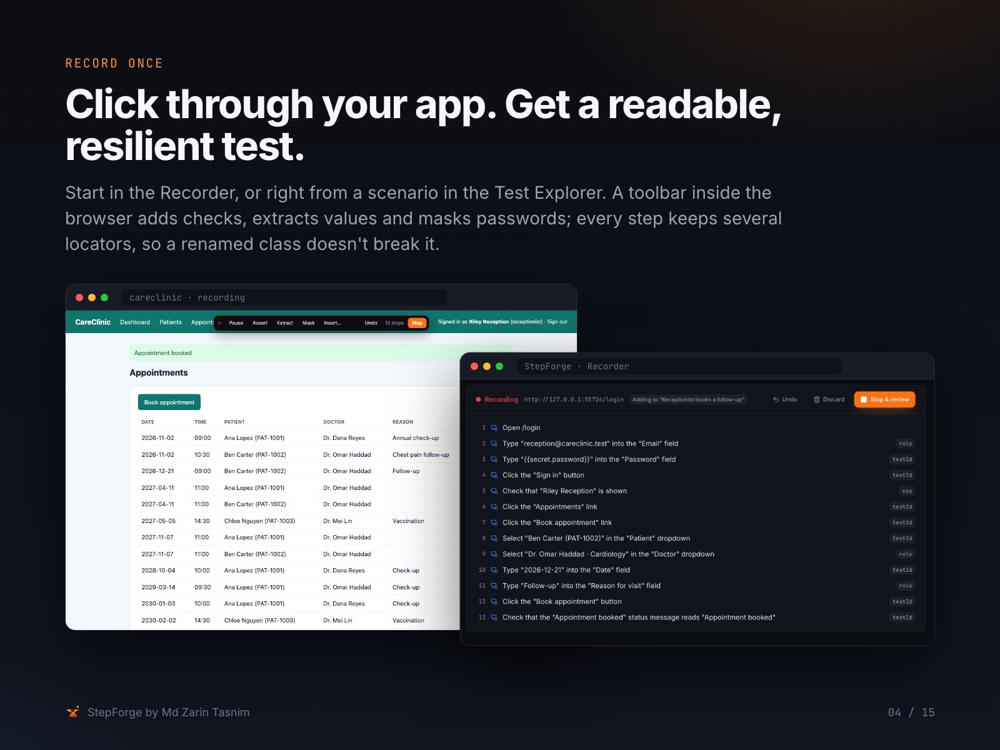

### Every layer in one scenario

A scenario is a list of typed steps. The hybrid example fills the registration form, reads the new patient code from
the page, finds that patient through the API and checks the row in the database, all in one test.

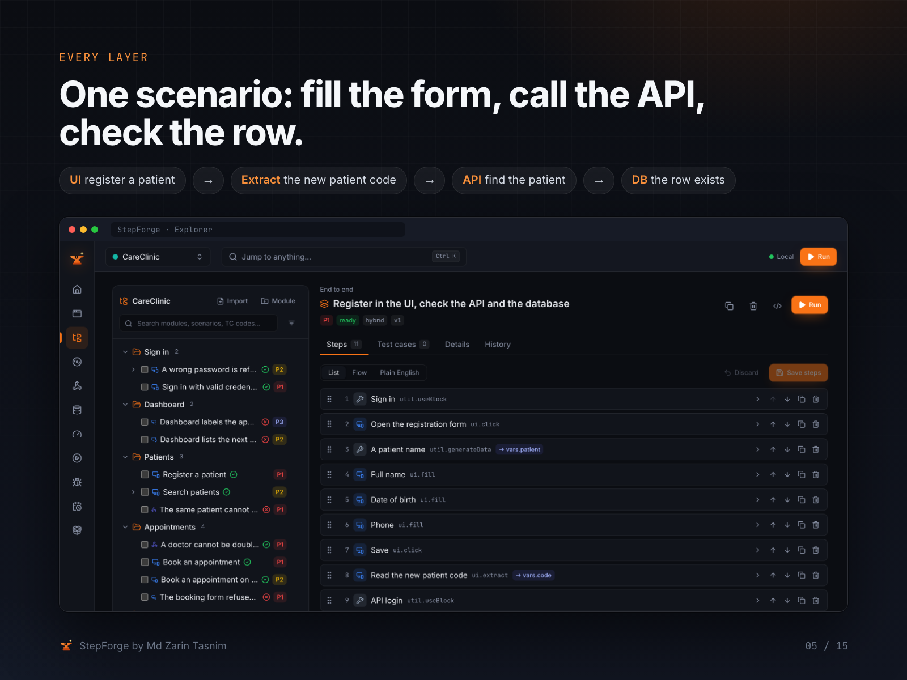

### API and database

The API client imports OpenAPI and Postman, resolves environment variables and secrets on the server, and checks each
response against the contract. The SQL workbench connects to SQLite, PostgreSQL, MySQL, SQL Server and MongoDB.
Connections start **read-only with rollback mode on**, and production environments show a red banner and ask you to
type the application name before anything destructive.

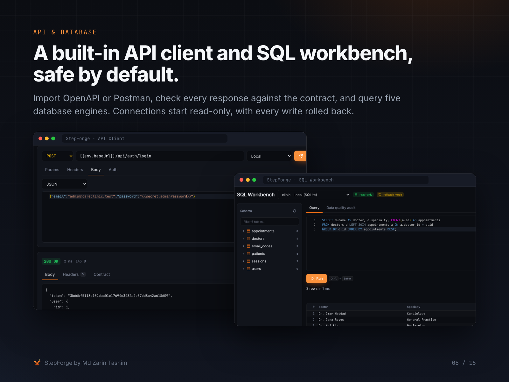

### Email and one-time codes

A bundled local mail catcher (Mailpit) receives the app's email. Steps wait for a message, check its subject and body,
and extract the one-time code or the verification link for the next UI step. Nothing is sent to the internet.

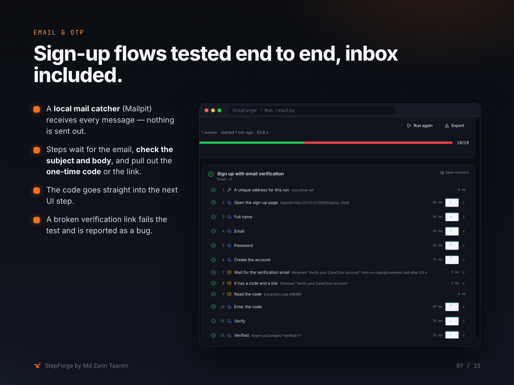

### Performance

Load tests use a built-in engine (or k6 when installed) with smoke, load, stress, spike and soak profiles and p95/p99,
error-rate and throughput thresholds. Before the first load test against an application, StepForge asks you to confirm
that you own or are authorised to test it, and stores that confirmation with a timestamp.

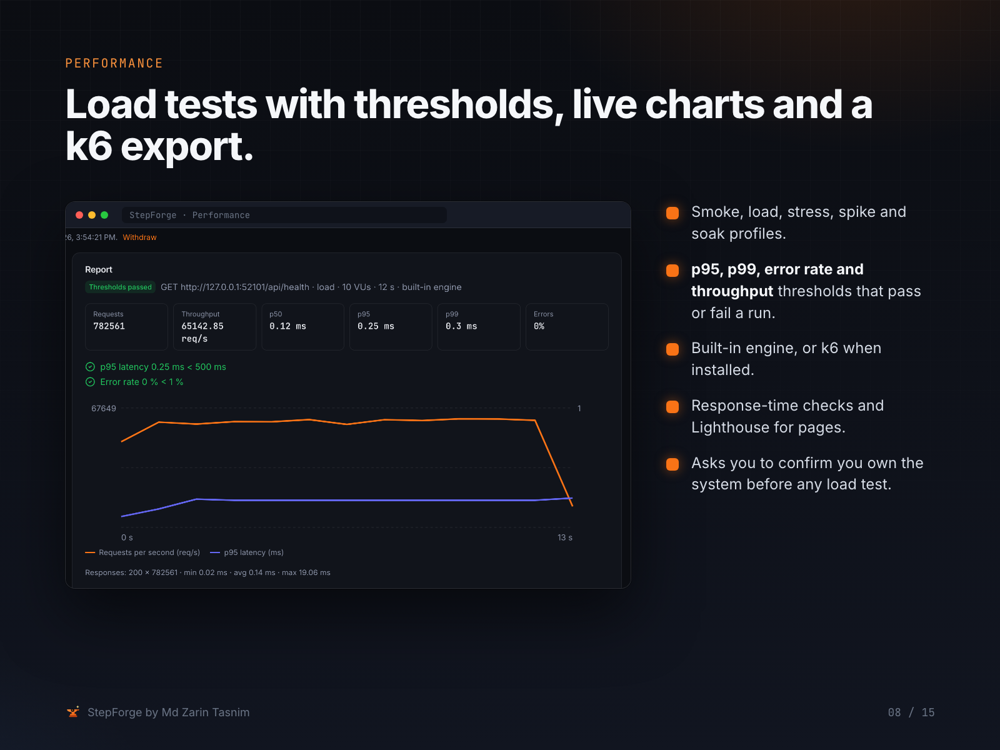

### Failure diagnosis

When a step fails, StepForge captures facts: the error, the failed check, network calls, console errors, the DOM
around the target and the page URL. A rule engine (readable YAML rules) turns them into a diagnosis with a category,
a plain-English explanation, an owner (app, test, data or environment) and a suggested fix. App bugs get a bug
report with screenshots and steps to reproduce, exportable as PDF, HTML, Markdown, Excel or Jira/Trello CSV.

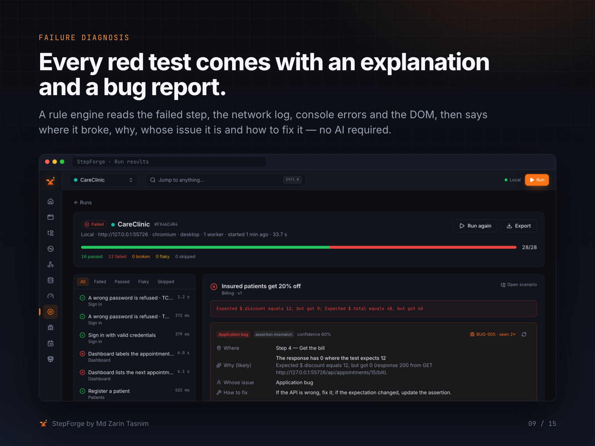

### Analytics and quality gates

Pass rates by module, layer, tag and environment, flaky-test detection, run comparison and release gates ("P1 pass
rate is 100%", "no open critical bugs", "API p95 under 800 ms") that turn red when a rule isn't met.

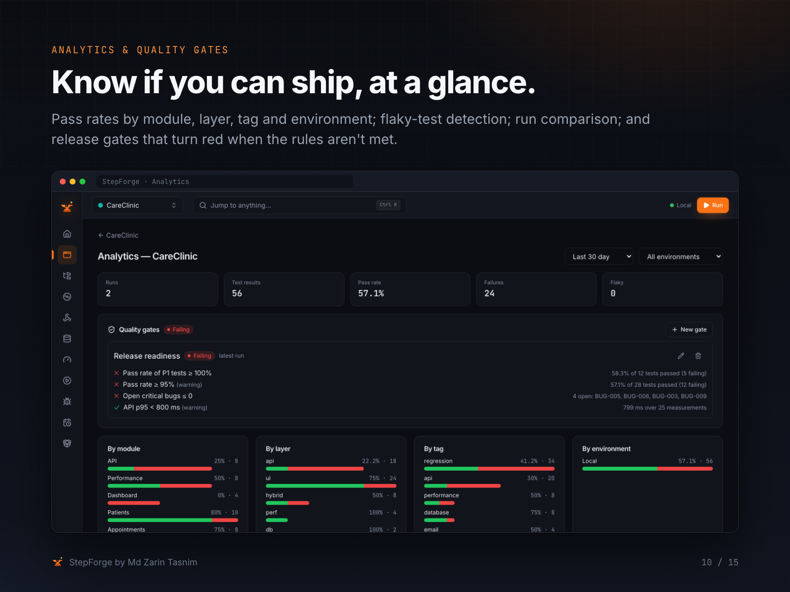

### Export anywhere

Scenarios export to 13 targets: Playwright (TypeScript and Python), Cypress, Selenium (Python and Java), pytest +
requests, REST Assured, k6, Postman, cURL, and Markdown, Gherkin and Excel test cases. Secrets become environment
variables, CI files are included, and CI runs the exported Playwright project against the demo app.

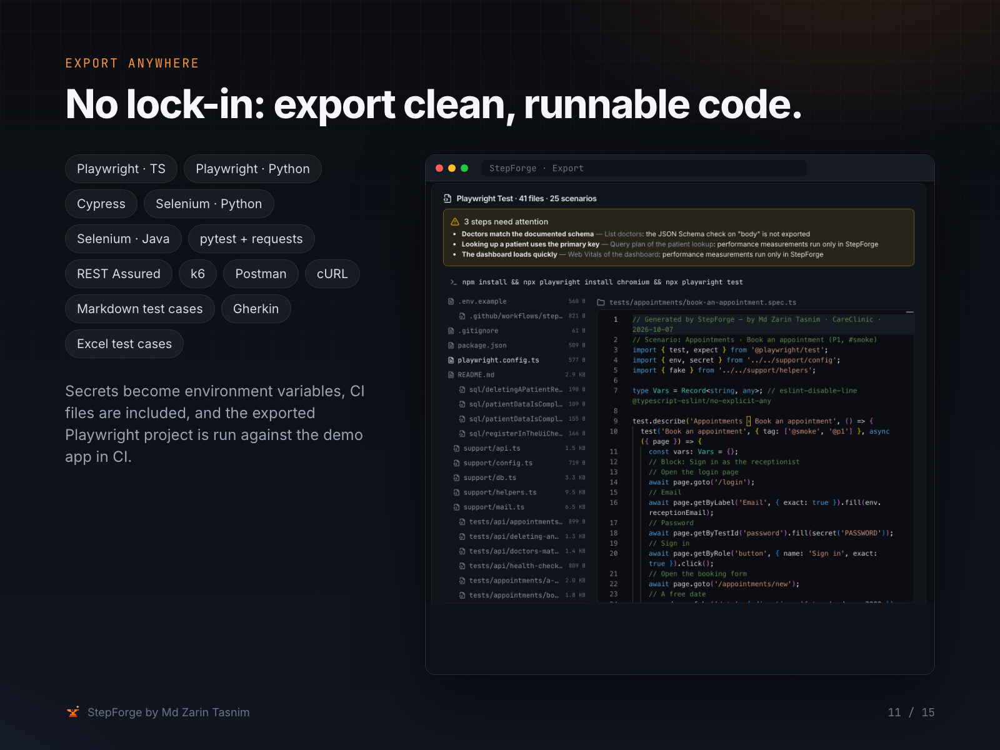

## 4. Engineering decisions

- **Secrets:** AES-256-GCM at rest; never logged or exported; masked as •••• in the UI, reports
  and generated code.
- **Local-first:** the server binds to 127.0.0.1 with a per-session token; all data lives in one SQLite file. AI is
  optional and only through a local Ollama.
- **Explainable diagnosis:** rules are data (YAML), so a wrong diagnosis is a reviewable rule change with a unit test,
  not a prompt tweak.
- **An honest benchmark:** see below.

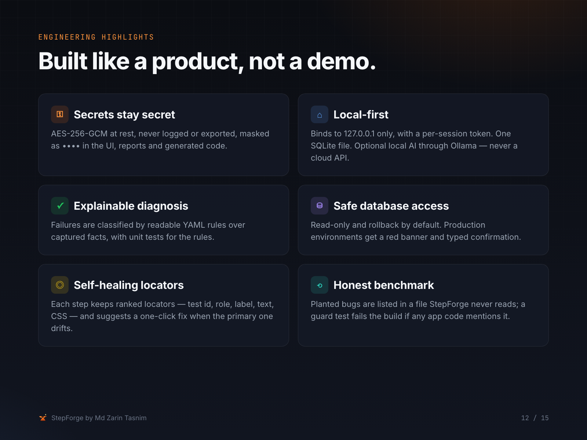

## 5. Results

To measure StepForge fairly, I wrote two small demo apps, **CareClinic** (a clinic: patients, appointments, billing,
sign-up email) and **ShopDesk** (a shop back office: products, stock, sales, profit), and planted bugs in them
across six layers: API, database, UI, email, business logic and performance. The bugs are listed in
`demo/manifests/planted_bugs.json`, with the diagnosis I'd accept for each, written **before** the first benchmark
run. StepForge never reads that file, and a guard test fails the build if any app or package code mentions it.

`scripts/benchmark.ts` loads the demo workspaces, runs every scenario at desktop size and the phone scenarios at
mobile size, one test at a time, and only then scores the results against the manifest.

| | Result |
| --- | --- |
| Planted bugs detected | **25 / 25 (100%)** |
| Diagnosed correctly | **24 / 25 (96%)** |
| False alarms | **0** |
| Scenarios / test runs | 45 / 51 |
| Total run time | 83.6 s (Apple M3 Pro) |

| Demo app | Scenarios | Test runs | Planted bugs | Detected | Diagnosed correctly |
| --- | --- | --- | --- | --- | --- |
| CareClinic | 25 | 29 | 13 | 13 | 12 |
| ShopDesk | 20 | 22 | 12 | 12 | 12 |

**The one miss.** CareClinic's dashboard labels the upcoming-appointments count "Cancelled appointments" (CC-UI-01).
The test caught it, but the same page also throws a JavaScript error from a second planted bug (CC-UI-03), and
StepForge blamed the label failure on that error. Since the error really is on the same page, I kept this as a
documented miss rather than tuning a rule to the benchmark.

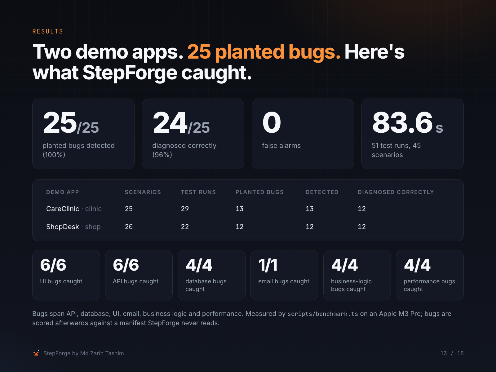

## 6. Tech stack

Node.js 22+, TypeScript and npm workspaces; Fastify, SQLite and Drizzle ORM on the server; React, Vite, Tailwind CSS,
TanStack, Monaco and React Flow in the dashboard; Playwright, autocannon, k6, Lighthouse and Mailpit as engines;
Vitest, Playwright E2E, ESLint, Prettier and GitHub Actions for quality.

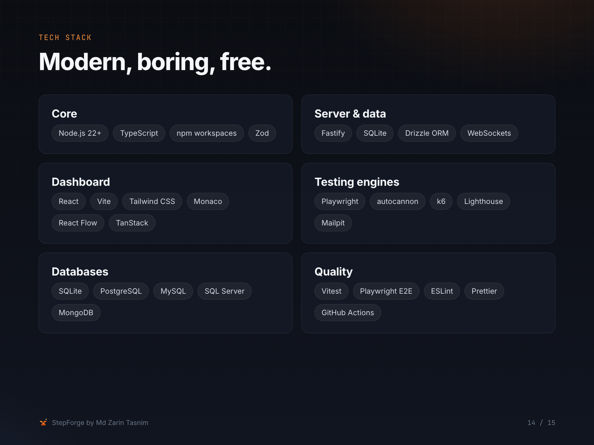

## 7. What I'd do next

- A desktop installer (Electron) so non-developers can start StepForge with a double-click.
- More diagnosis rules for pages with several simultaneous failures, like the CC-UI-01 miss above.
- Running the exported Cypress and Selenium projects in CI too, as the Playwright export already is.

## Try it

```bash
git clone https://github.com/zarindev/stepforge.git
cd stepforge && npm install && npm run build
npm start -- --demo
```

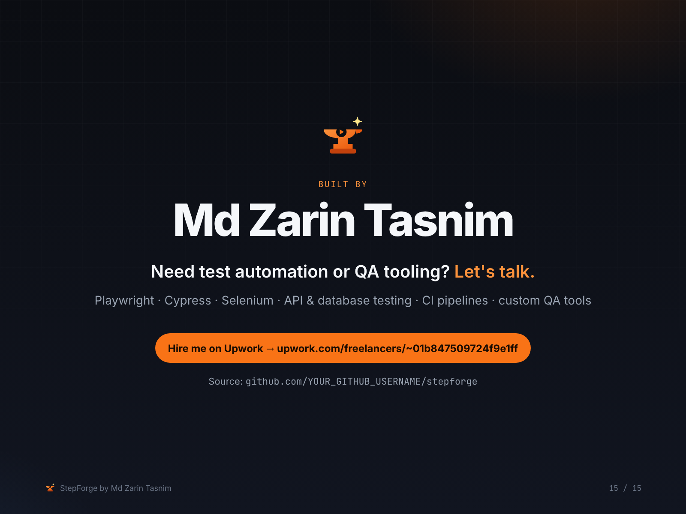

**Need test automation or QA tooling? Let's talk:** <https://www.upwork.com/freelancers/~01b847509724f9e1ff>
